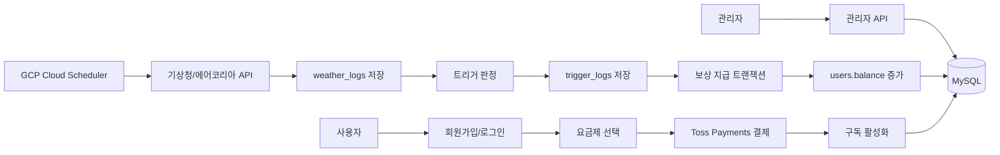

# Parami

Parami는 기상 데이터가 정해진 조건을 넘으면 별도 청구 없이 보상금을 자동 지급하는 날씨 기반 구독형 보상 서비스입니다. 사용자는 플랜을 구독하고, 시스템은 정기적으로 날씨를 수집해 트리거를 판정한 뒤 자격 있는 사용자에게 포인트를 적립합니다.

## 핵심 기능

| 영역 | 내용 |
| --- | --- |
| 랜딩 | 서비스 소개, 트리거 조건, 월별 트리거 차트, 요금제 안내 |
| 인증 | 이메일 회원가입/로그인, JWT 쿠키 세션, 로그아웃, 회원 탈퇴 |
| 구독 | Basic/Standard/Premium 플랜, 티어 변경 예약, 구독 해지, 만료 처리 |
| 결제 | Toss Payments 단건 결제 승인, 금액 검증, DB 실패 시 자동 환불 시도 |
| 날씨 | 기상청/에어코리아 API 기반 현재 날씨 수집 |
| 트리거 | 강수, 폭염, 한파, 눈, 미세먼지, 맑은 날 보너스 판정 |
| 보상 | 티어별 보상금 적립, 일/월 캡, 중복 지급 방지 |
| 출금 | 포인트 출금 요청 기록 및 관리자 조회 |
| 관리자 | 유저, 결제, 트리거, 보상, 출금, 대시보드 조회 |

## 기술 스택

| 구분 | 기술 |
| --- | --- |
| Framework | Next.js 16.2.6 App Router |
| UI | React 19, Tailwind CSS v4, shadcn/ui 기반 컴포넌트 |
| State | TanStack Query |
| DB | MySQL, mysql2/promise |
| Auth | JWT, bcryptjs |
| Payment | Toss Payments SDK/API |
| Weather | KMA API, AirKorea API |
| Chart | Recharts |
| Motion/Icon | framer-motion, lucide-react |
| Deploy | Docker, GCP Cloud Run 기준 설정 |
| Scheduler | GCP Cloud Scheduler -> Next.js API Route |

> 이 프로젝트는 Next.js 16 기준입니다. 예전 Next.js 지식과 다른 부분이 있으므로 라우팅/설정 변경 전 `node_modules/next/dist/docs/` 문서를 확인하세요. 특히 기존 `middleware.ts` 대신 `proxy.ts`를 사용합니다.

## 서비스 흐름



## 프로젝트 구조

```text
.
├─ app/
│  ├─ page.tsx                         # 랜딩 페이지
│  ├─ layout.tsx                       # 공통 레이아웃, Header/Footer/Providers
│  ├─ globals.css                      # Tailwind v4 @theme 디자인 토큰
│  ├─ (auth)/                          # 로그인, 회원가입
│  ├─ (consumer)/                      # 홈, 마이페이지, 결제, 보상, 날씨, 해지
│  ├─ admin/                           # 관리자 화면
│  └─ api/                             # 인증/결제/구독/날씨/보상/스케줄러/관리자 API
├─ components/
│  ├─ ui/                              # Button, Input, Card, Badge, Dialog 등
│  ├─ landing/                         # 랜딩 섹션 컴포넌트
│  ├─ header.tsx
│  ├─ header-weather.tsx
│  ├─ pricing-section.tsx
│  ├─ reward-calendar.tsx
│  └─ providers.tsx                    # TanStack Query, sonner Toaster
├─ lib/
│  ├─ db.ts                            # MySQL pool
│  ├─ auth.ts                          # API Route 인증 유틸
│  ├─ auth-server.ts                   # Server Component 세션 조회
│  ├─ client.ts                        # 프론트 API fetcher
│  ├─ weather.ts                       # 외부 날씨 API 호출/파싱
│  ├─ triggers.ts                      # 트리거 판정
│  ├─ rewards.ts                       # 보상 금액/KST 유틸
│  ├─ conditions.ts                    # 트리거 조건 상수
│  ├─ toss.ts                          # Toss API 헬퍼
│  └─ queries/                         # 도메인별 DB 쿼리
├─ db/
│  ├─ schema.sql                       # 기본 스키마 및 plans seed
│  ├─ schema.erd.json
│  └─ migrations/                      # 운영 반영용 증분 SQL
├─ scripts/
│  └─ check-db.mjs                     # DB 스키마/시드 sanity check
├─ types/
│  └─ db.ts
├─ proxy.ts                            # Next.js 16 라우트 가드
├─ Dockerfile
└─ next.config.ts                      # standalone output
```

## 시작하기

### 1. 의존성 설치

```bash
npm install
```

### 2. 환경변수 설정

`.env.local.example`을 복사해 `.env.local`을 만들고 값을 채웁니다.

```bash
cp .env.local.example .env.local
```

필수 환경변수:

| 이름 | 설명 |
| --- | --- |
| `DB_HOST` | MySQL 호스트 |
| `DB_PORT` | MySQL 포트, 기본값 3306 |
| `DB_USER` | MySQL 사용자 |
| `DB_PASSWORD` | MySQL 비밀번호 |
| `DB_NAME` | 사용할 DB 이름 |
| `JWT_SECRET` | JWT 서명용 secret |
| `KMA_API_KEY` | 기상청 API 키 |
| `AIRKOREA_API_KEY` | 에어코리아 API 키 |
| `NEXT_PUBLIC_TOSS_CLIENT_KEY` | 브라우저에서 사용하는 Toss client key |
| `TOSS_SECRET_KEY` | 서버 결제 승인용 Toss secret key |
| `SCHEDULER_SECRET` | 스케줄러 API 보호용 Bearer secret |

### 3. DB 준비

`db/schema.sql`을 MySQL에 적용합니다. 이 파일은 기본 테이블과 `plans` seed를 포함합니다.

```bash
mysql -h <host> -u <user> -p <db_name> < db/schema.sql
```

운영 DB나 이미 생성된 DB에는 `db/migrations/`의 SQL을 순서대로 적용합니다.

```text
001_subscriptions_add_pending_tier.sql
002_subscriptions_status_add_expired.sql
003_users_add_deleted_at.sql
004_create_withdrawal_logs.sql
005_reward_amounts_increase.sql
006_user_accounts_drop_oauth.sql
```

DB 상태 확인:

```bash
npm run check-db
```

### 4. 개발 서버 실행

```bash
npm run dev
```

브라우저에서 `http://localhost:3000`으로 접속합니다.

## 스크립트

| 명령어 | 설명 |
| --- | --- |
| `npm run dev` | 개발 서버 실행 |
| `npm run build` | 프로덕션 빌드 및 타입 체크 |
| `npm run start` | 빌드 결과 실행 |
| `npm run lint` | ESLint 검사 |
| `npm run check-db` | DB 테이블/컬럼/seed sanity check |

## 주요 라우트

### 사용자 화면

| 경로 | 설명 |
| --- | --- |
| `/` | 랜딩 |
| `/login` | 로그인 |
| `/signup` | 회원가입 |
| `/home` | 로그인 후 홈 |
| `/weather` | 현재 날씨 및 예보 |
| `/pricing` | 요금제 선택/변경 |
| `/payment` | 결제 |
| `/payment/complete` | 결제 완료 |
| `/mypage` | 내 정보, 구독, 보상, 출금, 탈퇴 |
| `/rewards` | 보상 내역 |
| `/cancel-subscription` | 구독 해지 |

### 관리자 화면

| 경로 | 설명 |
| --- | --- |
| `/admin/dashboard` | 관리자 대시보드 |
| `/admin/users` | 유저 목록 |
| `/admin/payments` | 결제 내역 |
| `/admin/triggers` | 트리거 발동 내역 |
| `/admin/rewards` | 보상 지급 내역 |
| `/admin/withdrawals` | 출금 내역 |

## API 요약

API 응답은 기본적으로 아래 envelope를 사용합니다.

```ts
// 성공
{ success: true, data: unknown }

// 실패
{ success: false, error: string }
```

### 인증

| Method | Endpoint | 설명 |
| --- | --- | --- |
| `POST` | `/api/auth/signup` | 회원가입 |
| `POST` | `/api/auth/login` | 로그인 |
| `POST` | `/api/auth/logout` | 로그아웃 |
| `GET` | `/api/auth/me` | 내 정보 조회 |
| `PATCH` | `/api/auth/profile` | 내 프로필 수정 |
| `DELETE` | `/api/auth/withdraw` | 회원 탈퇴 |

### 결제/구독

| Method | Endpoint | 설명 |
| --- | --- | --- |
| `GET` | `/api/plans` | 플랜 목록 |
| `POST` | `/api/payments/confirm` | Toss 결제 승인 및 구독 반영 |
| `GET` | `/api/payments/me` | 내 결제 내역 |
| `GET` | `/api/subscriptions/me` | 내 구독 상태 |
| `PATCH` | `/api/subscriptions/change-tier` | 티어 변경 예약 |
| `PATCH` | `/api/subscriptions/cancel` | 구독 해지 |

### 날씨/보상/출금

| Method | Endpoint | 설명 |
| --- | --- | --- |
| `GET` | `/api/weather/current` | 현재 날씨 |
| `GET` | `/api/rewards/me` | 내 보상 내역 |
| `GET` | `/api/rewards/summary` | 내 보상 요약 |
| `POST` | `/api/rewards/withdraw` | 포인트 출금 요청 |

### 스케줄러

| Method | Endpoint | 설명 |
| --- | --- | --- |
| `POST` | `/api/scheduler/weather-check` | 날씨 수집, 트리거 판정, 보상 지급 |
| `POST` | `/api/scheduler/expire-subscriptions` | 결제 만료 구독을 `expired` 처리 |

스케줄러 호출 예시:

```bash
curl -X POST http://localhost:3000/api/scheduler/weather-check \
  -H "Authorization: Bearer $SCHEDULER_SECRET"
```

### 관리자

| Method | Endpoint | 설명 |
| --- | --- | --- |
| `GET` | `/api/admin/dashboard-stats` | 관리자 대시보드 통계 |
| `GET` | `/api/admin/users` | 유저 목록 |
| `GET` | `/api/admin/subscriptions` | 구독 목록 |
| `GET` | `/api/admin/payments` | 결제 내역 |
| `GET` | `/api/admin/triggers` | 트리거 내역 |
| `GET` | `/api/admin/rewards` | 보상 지급 내역 |
| `GET` | `/api/admin/withdrawals` | 출금 내역 |

## DB 모델

| 테이블 | 역할 |
| --- | --- |
| `users` | 회원, 권한, 잔액, soft delete |
| `user_accounts` | 로그인 계정 (MVP는 자체 이메일 로그인만) |
| `plans` | basic/standard/premium 가격표 |
| `subscriptions` | 구독 상태, 현재 티어, 다음 결제일, 변경 예약 |
| `payments` | Toss 결제 내역 |
| `weather_logs` | 외부 날씨 API 수집 이력 |
| `trigger_logs` | 트리거 발동 이력 |
| `reward_logs` | 유저별 보상 지급 이력 |
| `withdrawal_logs` | 포인트 출금 이력 |

중요 제약:

| 제약 | 목적 |
| --- | --- |
| `trigger_logs.UNIQUE(trigger_type, triggered_date)` | 같은 트리거는 하루 1회만 발동 |
| `reward_logs.UNIQUE(user_id, trigger_log_id)` | 같은 트리거에 대한 중복 보상 방지 |
| `reward_logs.idx_user_reward_month` | 월 보상 캡 조회 최적화 |
| `withdrawal_logs.idx_user_withdrawn` | 사용자별 출금 이력 조회 |

## 트리거와 보상 정책

트리거 조건은 `lib/conditions.ts`에서 관리합니다.

| 트리거 | 조건 |
| --- | --- |
| 강수 | 강수량 3mm 이상 |
| 폭염 | 기온 33도 이상 |
| 한파 | 기온 -12도 이하 |
| 눈 | 기상청 PTY 코드가 2, 3, 6, 7 중 하나 |
| 미세먼지 | PM2.5 50 이상 |
| 맑은 날 보너스 | 4,5,6,9,10,11월 중 강수 1mm 이하, PM2.5 30 이하, 풍속 5m/s 이하 |

보상 금액:

| 티어 | 1회 보상 | 월 최대 |
| --- | ---: | ---: |
| Basic | 900원 | 9,000원 |
| Standard | 1,600원 | 16,000원 |
| Premium | 2,600원 | 26,000원 |

공통 정책:

- 월 최대 보상 횟수는 10회입니다.
- KST 기준으로 일/월 캡을 계산합니다.
- active 구독자이면서 최근 결제 성공 이력이 있는 유저만 지급 대상입니다.
- 보상 지급은 `reward_logs` INSERT와 `users.balance` 증가를 한 트랜잭션으로 처리합니다.

## 결제 정책

- 클라이언트가 보낸 금액을 신뢰하지 않고, 서버가 DB의 `plans.price`와 비교합니다.
- 기존 active 구독자가 `pending_tier`를 가지고 있으면 다음 결제 승인 시 해당 티어를 적용합니다.
- Toss 결제 승인 후 DB 처리에 실패하면 `cancelTossPayment`로 자동 환불을 시도합니다.
- 결제는 월 단위 구독처럼 운영하지만, 자동 갱신 결제가 아니라 단건 결제 승인 방식입니다.

## 인증/권한

- 로그인 성공 시 JWT를 쿠키에 저장합니다.
- API Route에서는 `lib/auth.ts`의 `requireUser`, `requireAdmin`을 사용합니다.
- Server Component에서는 `lib/auth-server.ts`의 `getServerSession`을 사용합니다.
- `proxy.ts`는 라우트 접근 가드 역할을 합니다. Next.js Edge 런타임 제약 때문에 JWT role 검증은 API Route 또는 Server Component 쪽에서 처리합니다.

## 프론트엔드 개발 규칙

- 프론트 API 호출은 `lib/client.ts`의 `api.get`, `api.post`, `api.patch`, `api.delete`를 사용합니다.
- 색상/라운드/폰트 토큰은 `app/globals.css`의 `@theme` 값을 우선 사용합니다.
- UI는 `components/ui/`의 Button, Input, Card, Badge, Dialog 등을 우선 사용합니다.
- 아이콘은 `lucide-react`를 사용합니다.
- 사용자 화면은 `app/(consumer)/`, 인증 화면은 `app/(auth)/`, 관리자 화면은 `app/admin/`에 둡니다.
- Next.js 16 관련 라우팅/설정 변경 시 로컬 문서 `node_modules/next/dist/docs/01-app/`를 먼저 확인합니다.

## 배포 메모

`next.config.ts`는 Cloud Run/Docker 배포를 위해 standalone output을 사용합니다.

```ts
const nextConfig = {
  output: "standalone",
}
```

Docker 빌드:

```bash
docker build -t parami .
docker run --env-file .env.local -p 3000:3000 parami
```

운영 환경에서는 최소한 아래 작업을 확인합니다.

- `.env.local`에 해당하는 secret을 Cloud Run 환경변수로 등록
- MySQL 접근 네트워크 설정
- Cloud Scheduler에서 `/api/scheduler/weather-check`와 `/api/scheduler/expire-subscriptions` 호출
- Scheduler 요청에 `Authorization: Bearer <SCHEDULER_SECRET>` 헤더 포함

## 품질 확인 체크리스트

PR 전 최소 확인:

```bash
npm run lint
npm run build
npm run check-db
```

기능별 추가 확인:

| 변경 영역 | 확인 |
| --- | --- |
| DB 변경 | `db/schema.sql`, `db/migrations/`, `scripts/check-db.mjs` 동기화 |
| 결제 변경 | 금액 검증, Toss 실패 응답, DB 실패 후 환불 분기 |
| 스케줄러 변경 | 중복 트리거, 월 캡, 트랜잭션, 재시도 멱등성 |
| 인증 변경 | 쿠키 세션, API 권한, 관리자 접근 제한 |
| UI 변경 | 모바일/데스크탑 레이아웃, 토큰 사용, lint/build |

## 브랜치/커밋 규칙

브랜치 예시:

```text
feature/이름-기능명
fix/이름-버그명
docs/이름-문서명
style/영역-작업명
```

커밋 타입:

| 타입 | 용도 |
| --- | --- |
| `feat` | 새 기능 |
| `fix` | 버그 수정 |
| `docs` | 문서 |
| `style` | UI/스타일 |
| `refactor` | 구조 개선 |
| `chore` | 설정/패키지/기타 |

## 팀 역할

| 담당 | 역할 |
| --- | --- |
| 우석 | 스케줄러, 트리거, 보상 지급, 관리자 조회 API |
| 소라 | 결제, 구독, 보상 조회 |
| 영현 | 인증 |
| 여진 | 소비자 페이지 |
| 명진 | 관리자 페이지 |
